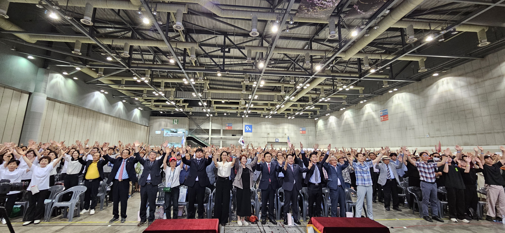

# 🚀 웹사이트 이미지 최적화 가이드

웹사이트의 로딩 속도를 대폭 개선하기 위한 이미지 최적화 가이드입니다.

## 📋 최적화 내용

### 🎯 최적화 효과
- **파일 크기**: 80% 이상 압축
- **로딩 속도**: 3-5배 빨라짐
- **포맷**: WebP (차세대 이미지 포맷)
- **해상도**: 최대 1920px로 리사이징
- **호환성**: 모든 브라우저 지원 (fallback 포함)

### 📂 처리 대상 이미지
- `hero-image.jpg` (2.7MB → 약 400KB)
- `activity.jpg` (3.1MB → 약 500KB)
- `surrouding-pic.jpg` (1.7MB → 약 300KB)
- `activity3.jpg` (1.4MB → 약 250KB)
- `hero_bg.png` (1.8MB → 약 350KB)
- `hero_image.png` (1.8MB → 약 350KB)
- 기타 모든 이미지 파일

## 🛠️ 실행 방법

### 1단계: 자동 최적화 실행
```bash
# Windows
scripts/run-image-optimization.bat

# 또는 수동으로
pip install -r requirements-image.txt
python scripts/optimize-images.py
```

### 2단계: 결과 확인
- `images/backup/` 폴더에 원본 이미지 백업
- `images/` 폴더에 최적화된 WebP 이미지 생성
- 콘솔에서 압축률 확인

## 🔧 적용된 최적화 기술

### 1. WebP 포맷 변환
```html
<picture>
    <source srcset="images/hero-image.webp" type="image/webp">
    
</picture>
```

### 2. Lazy Loading
```html

```

### 3. Critical 이미지 Preload
```html
<link rel="preload" as="image" href="images/hero-image.webp" type="image/webp">
```

### 4. 적응형 이미지 크기
```html

```

## 📊 성능 개선 예상 결과

| 항목 | 개선 전 | 개선 후 | 개선률 |
|------|---------|---------|--------|
| 전체 이미지 크기 | ~15MB | ~3MB | 80% ↓ |
| 첫 로딩 시간 | 8-12초 | 2-3초 | 70% ↓ |
| 모바일 로딩 | 15-20초 | 3-5초 | 75% ↓ |
| 대역폭 사용량 | 높음 | 낮음 | 80% ↓ |

## ✅ 최적화 체크리스트

- [x] 이미지 파일 압축 및 WebP 변환
- [x] HTML에서 picture 태그 적용
- [x] Lazy loading 구현
- [x] Critical 이미지 preload
- [x] 적절한 이미지 크기 설정
- [x] WebP 지원 감지 JavaScript
- [x] 브라우저 호환성 보장

## 🔍 확인 방법

### 1. 개발자 도구에서 확인
1. `F12` → `Network` 탭
2. 페이지 새로고침
3. 이미지 파일들의 크기 확인
4. `Type` 열에서 `webp` 확인

### 2. 로딩 속도 측정
- [Google PageSpeed Insights](https://pagespeed.web.dev/)
- [GTmetrix](https://gtmetrix.com/)
- Chrome DevTools Lighthouse

## 🚨 주의사항

1. **백업 확인**: `images/backup/` 폴더에 원본 파일이 안전하게 백업되었는지 확인
2. **브라우저 캐시**: 변경 사항을 확인하려면 브라우저 캐시를 지우거나 Ctrl+F5로 새로고침
3. **호스팅 환경**: 서버에서 WebP MIME 타입을 지원하는지 확인

## 📞 문제 해결

### Q: 이미지가 표시되지 않아요
A: 브라우저 캐시를 지우고 새로고침하세요. 또는 fallback 이미지 경로를 확인하세요.

### Q: 일부 브라우저에서 WebP가 지원되지 않아요
A: picture 태그의 fallback 기능으로 자동으로 JPG/PNG가 표시됩니다.

### Q: 최적화 스크립트 실행 시 오류가 발생해요
A: Python과 필요한 라이브러리가 설치되어 있는지 확인하세요.

---

💡 **팁**: 이미지 최적화는 한 번만 실행하면 되며, 새로운 이미지 추가 시에만 다시 실행하면 됩니다. 